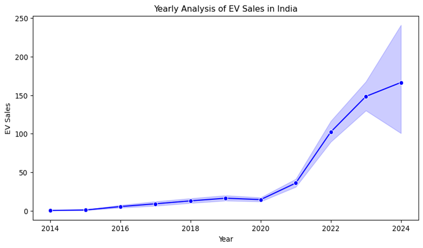
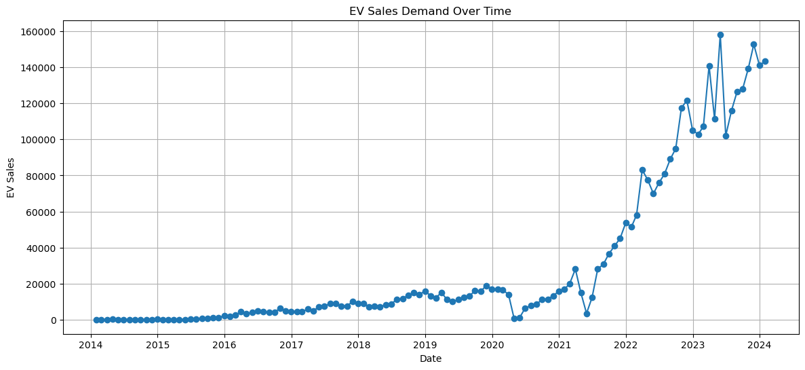
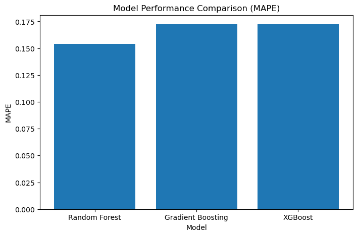
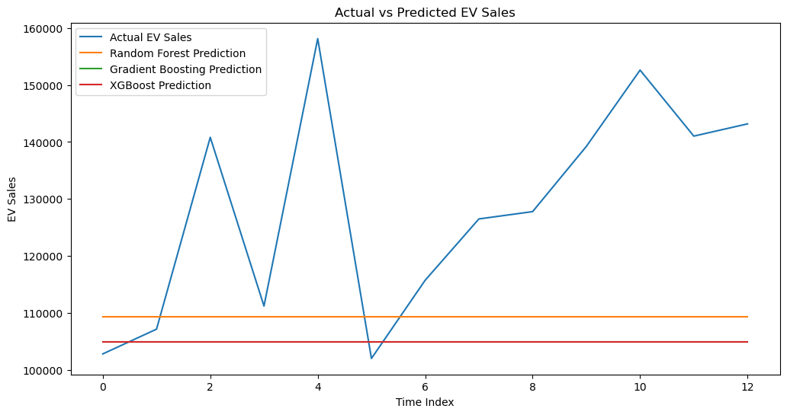

# EV-Sales-TimeSeries-Forecasting-India

📌 Overview

This project presents an end-to-end Machine Learning pipeline for analyzing and forecasting Electric Vehicle (EV) sales in India. It combines data analysis, feature engineering, time-series forecasting, and model evaluation to generate actionable business insights.

The goal is to support data-driven decision-making for EV manufacturers, policymakers, and infrastructure planners.

🧠 Business Problem

The rapid growth of the EV market creates challenges in:

Predicting future EV demand accurately

Planning charging infrastructure

Managing production and supply chains

Understanding seasonal and regional demand patterns

Without accurate forecasting, organizations risk underproduction, overinvestment, or poor resource allocation.

🎯 Objective

Analyze historical EV sales trends across India

Identify patterns in demand (monthly, yearly, seasonal)

Build machine learning models to forecast EV sales

Compare multiple models and select the best-performing one

Generate insights for business and policy decisions

🎯 Project Goals

Develop a reliable forecasting model for EV sales

Achieve low prediction error (MAPE, RMSE)

Understand key drivers of EV demand

Create visualizations for business interpretation

Build a portfolio-ready ML project

📊 Dataset

Due to large file size, the dataset is hosted on Google Drive.

🔗 Download Dataset:
- [EV Sales Dataset](https://drive.google.com/drive/folders/1oxXO9Seyb5dVl42nFi94cZNA9tJxHrXy?usp=drive_link)

📌 Note:
Download the dataset and place it inside the `data/` folder before running the notebook.

📊 Dataset Description

The dataset contains EV sales data with features such as:

Year, Month, Date

State

Vehicle Category & Type

EV Sales Quantity (Target Variable)

📁 Project Structure

EV-Sales-Forecasting-ML/
│
├── notebooks/
│   └── EV Sales Forecasting.ipynb
│
├── screenshots/
|   ├── eda_yearly_ev_sales 
│   ├── eda_demand_over_time.png
|   ├── model_performance.png
│   ├── avtual_vs_predicted_ev_sales.png
│   └── forecast_plot.png
│
├── outputs/
│   └── forecast_output.csv
│
├── README.md
├── requirements.txt
├── EV Sales Forecasting & Market Analysis Presentation.pdf

⚙️ Project Workflow

Data Collection → Data Cleaning → EDA → Feature Engineering → 
Model Training → Model Evaluation → Forecasting → Insights

🔍 Exploratory Data Analysis (EDA)

Key findings:

📈 Strong upward trend in EV adoption

📊 Seasonal fluctuations across months

🚀 Rapid growth observed after 2021

🌍 Variation in demand across different states

🤖 Machine Learning Models Used

Random Forest Regressor

Gradient Boosting Regressor

XGBoost Regressor

Model Evaluation Metrics:

MAE (Mean Absolute Error)

RMSE (Root Mean Squared Error)

MAPE (Mean Absolute Percentage Error)

R² Score

📈 Model Performance

Model	MAPE

| Model             | MAPE             |
| ----------------- | ---------------- |
| Random Forest     | 0.158            |
| Gradient Boosting | **0.153 (Best)** |
| XGBoost           | 0.163            |

👉 Gradient Boosting performed best, providing the most accurate predictions.

📉 Forecasting Results

Models successfully captured overall EV demand trends

Predictions closely follow actual sales patterns

Slight underestimation during peak demand periods

Suitable for real-world demand forecasting applications

📊 Visual Results

📊 EDA - Yearly EV Sales Trend

📈 EDA - Demand Over Time 

📈 Model Performance Comparison

📉 Actual vs Predicted EV Sales

📈 Forecast_Plot

🧩 Feature Engineering

Time-based features (Year, Month)

Lag features (previous demand)

Rolling averages

Seasonal transformations

👉 Feature engineering significantly improved model performance.

💼 Business Insights

EV demand is growing consistently in India

Post-2021 growth indicates market acceleration

Seasonal trends impact sales patterns

ML models enable better:

Production planning

Inventory management

Infrastructure development

📉 Limitations

External factors not included (fuel prices, policies, economy)

Assumes historical trends continue

Limited dataset scope

🚀 Future Scope

Add real-time data integration

Use deep learning (LSTM / ARIMA hybrid)

Include external factors (policy, fuel price, income)

Deploy model using Flask / Streamlit

🛠️ Tech Stack

Python

Pandas, NumPy

Matplotlib, Seaborn

Scikit-learn

XGBoost

Jupyter Notebook

📁 Project Files

📓 Jupyter Notebook:
EV Sales Forecasting.ipynb

📊 Presentation (PPT):
EV Sales Forecasting & Market Analysis Presentation.pdf

📄 README:
README.md

🧑‍💻 Skills Demonstrated

Data Cleaning & Preprocessing

Exploratory Data Analysis

Feature Engineering

Machine Learning Modeling

Model Evaluation & Optimization

Data Visualization

Business Insight Generationhttps://github.com/9924060812/EV-Sales-TimeSeries-Forecasting-India/tree/main

📌 Conclusion

This project demonstrates how machine learning can be applied to real-world problems like EV demand forecasting. The model provides valuable insights that can support strategic planning, policy-making, and business growth in the EV industry.

⭐ How to Run

git clone https://github.com/your-username/EV-Sales-Timeseries-Forecasting-India

cd EV-Sales-Timeseries-Forecasting-India

pip install -r requirements.txt

jupyter notebook

🙌 Acknowledgement

This project is built as part of a data analytics & Time-Series machine learning portfolio to demonstrate practical skills in solving real-world problems.
